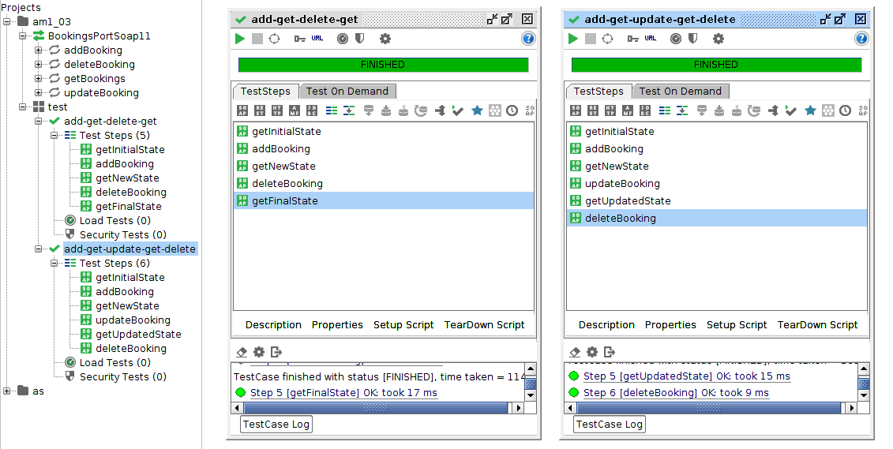
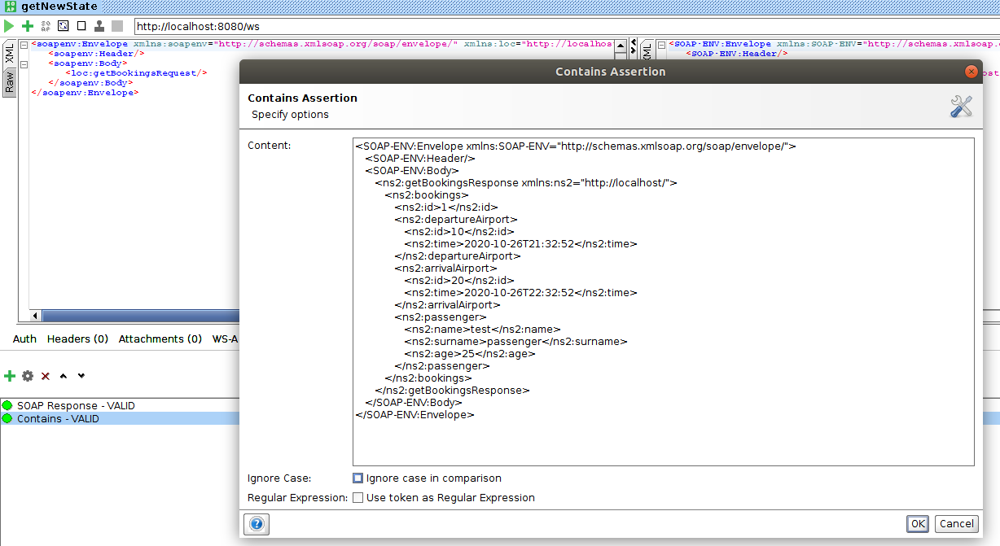

# HW3 - 3. Web Services

## Task

* Implement a simple SOAP/SWDL Web Service for management of Flight bookings.
  - Use "Contract-First" approach and define XML Schema first.
  - As storage you can use a static List in Java.
  - Implement operations for: 1) listing existing bookings, 2) add booking, 3) remove and 4) update booking.
  - Each Flight booking should be described by at least: passenger information, departure and arrival dates aligned with airport identifiers.
* Import the service WSDL in the SoapUI.
 - Create a Test Case for each operation.
 - Add assertions to validate outputs of operation.
 - The Test Cases should cover the simple scenario: check the initial state, add or modify item, check the state, remove any item and check the state as well.
 
## Solution

File defining the web service operation is in [bookings.xsd](src/main/resources/bookings.xsd). 

The application supports all CRUD operations described in the assingment.

Here is the SOAP format to perform these operations 

1) Retrieving data

```
<soapenv:Envelope xmlns:soapenv="http://schemas.xmlsoap.org/soap/envelope/" xmlns:loc="http://localhost/">
   <soapenv:Header/>
   <soapenv:Body>
      <loc:getBookingsRequest/>
   </soapenv:Body>
</soapenv:Envelope>
``` 

2) Adding data

```
<soapenv:Envelope xmlns:soapenv="http://schemas.xmlsoap.org/soap/envelope/" xmlns:loc="http://localhost/">
   <soapenv:Header/>
   <soapenv:Body>
      <loc:addBookingRequest>
         <loc:booking>
            <loc:id>1</loc:id>
            <loc:departureAirport>
               <loc:id>10</loc:id>
               <loc:time>2020-10-26T21:32:52</loc:time>
            </loc:departureAirport>
            <loc:arrivalAirport>
               <loc:id>20</loc:id>
               <loc:time>2020-10-26T22:32:52</loc:time>
            </loc:arrivalAirport>
            <loc:passenger>
               <loc:name>test</loc:name>
               <loc:surname>passenger</loc:surname>
               <loc:age>25</loc:age>
            </loc:passenger>
         </loc:booking>
      </loc:addBookingRequest>
   </soapenv:Body>
</soapenv:Envelope>
```

3) Deleting data

```
<soapenv:Envelope xmlns:soapenv="http://schemas.xmlsoap.org/soap/envelope/" xmlns:loc="http://localhost/">
   <soapenv:Header/>
   <soapenv:Body>
      <loc:deleteBookingRequest>
         <loc:id>1</loc:id>
      </loc:deleteBookingRequest>
   </soapenv:Body>
</soapenv:Envelope>
```

4) Updating data - same as adding data, however, fields will be updated

```
<soapenv:Envelope xmlns:soapenv="http://schemas.xmlsoap.org/soap/envelope/" xmlns:loc="http://localhost/">
   <soapenv:Header/>
   <soapenv:Body>
      <loc:updateBookingRequest>
         <loc:booking>
            <loc:id>1</loc:id>
            <loc:departureAirport>
               <loc:id>10</loc:id>
               <loc:time>2020-10-26T21:32:52</loc:time>
            </loc:departureAirport>
            <loc:arrivalAirport>
               <loc:id>20</loc:id>
               <loc:time>2020-10-26T22:32:52</loc:time>
            </loc:arrivalAirport>
            <loc:passenger>
               <loc:name>test</loc:name>
               <loc:surname>surname update</loc:surname>
               <loc:age>25</loc:age>
            </loc:passenger>
         </loc:booking>
      </loc:updateBookingRequest>
   </soapenv:Body>
</soapenv:Envelope>
```

### Testing

SoapUI was used to test the application. All 4 CRUD operations are tested in 2 test cases.

You can see both test cases passing with all steps included
 
 

The "contains" SoapUI tool is used to verify correct responses.

 