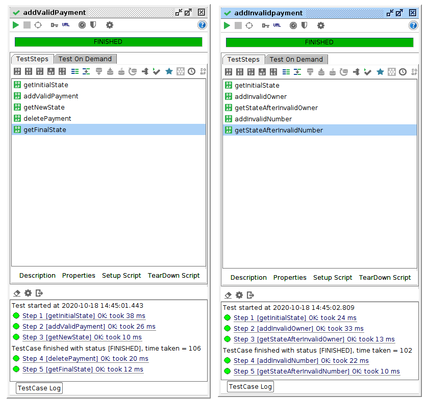

# HW4 - Web Service Composition

## Task

* Implement a Payment Web Service (SOAP/WSDL)
 - Use "Contract-First" approach and define XML Schema first.
 - As storage you can use a static List in Java.
 - Implement operations: 1) List all payments 2) Add a new payment requiring parameters: credit card number, credit card owner, order identifier.
 - New payment can be accepted only with valid card identifiers.
 - During processing of the payment:
   - Validate data using existing Card Validation Web Service: http://147.32.233.18:8888/NI-AM1-CardValidation/ws/card.wsdl
   - Valid data: cardNumber="1234-1234-1234-1234" & cardOwner="CardOwner"
 - You should use automatic generation of the client (See the tutorials for more information)
 - Test the service
 
 
## Solution
 
File defining the web service operation is in [payment.xsd](src/main/resources/payment.xsd). 
 
The application supports Create and Read operations as well as a Delete operation which is used during tests. 
 
Here is the SOAP format to perform these operations 
 
1) Retrieving data
 
 ```
<soapenv:Envelope xmlns:soapenv="http://schemas.xmlsoap.org/soap/envelope/" xmlns:loc="http://localhost/">
   <soapenv:Header/>
   <soapenv:Body>
      <loc:getPaymentsRequest/>
   </soapenv:Body>
</soapenv:Envelope>
 ``` 
 
2) Adding data
 
 ```
<soapenv:Envelope xmlns:soapenv="http://schemas.xmlsoap.org/soap/envelope/" xmlns:loc="http://localhost/">
   <soapenv:Header/>
   <soapenv:Body>
      <loc:addPaymentRequest>
         <loc:payment>
            <loc:cardNumber>1234-1234-1234-1234</loc:cardNumber>
            <loc:cardOwner>CardOwner</loc:cardOwner>
            <loc:id>1</loc:id>
         </loc:payment>
      </loc:addPaymentRequest>
   </soapenv:Body>
</soapenv:Envelope>
 ```
 
3) Deleting data
 
 ```
<soapenv:Envelope xmlns:soapenv="http://schemas.xmlsoap.org/soap/envelope/" xmlns:loc="http://localhost/">
   <soapenv:Header/>
   <soapenv:Body>
      <loc:deletePaymentRequest>
         <loc:id>1</loc:id>
      </loc:deletePaymentRequest>
   </soapenv:Body>
</soapenv:Envelope>
 ```
 
 
### Testing
 
SoapUI was used to test the application. There are 2 test cases to cover valid data and invalid data inputs.

The exported SoapUI project can be found [in the results directory](results/am1_04-soapui-project.xml)

Both test cases can be seen in the following picture

  

The "contains" SoapUI tool is used to verify correct responses.

 

